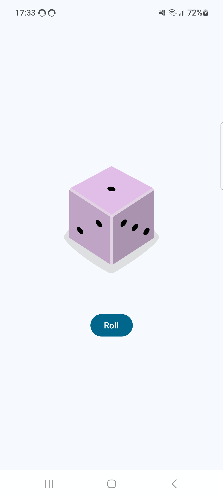

# Dice Roller

- Used `mutableStateOf` observable data holder, to trigger recomposition, when data changes.
- Used `by rememer` to persist value across recompositions
- Show a icon based on random number (1..6) on button click

