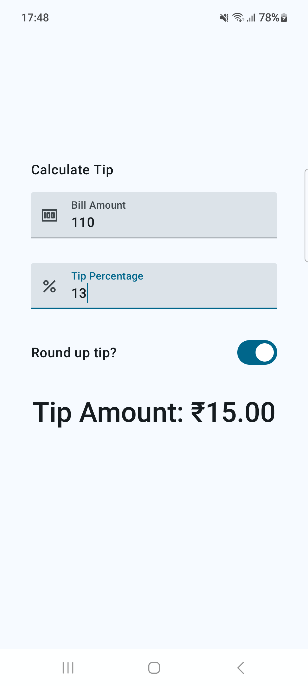

# Tip Time

- Get user input in TextField Composables
- Use Switch Composable
- Use Local Currency Formatter (`NumberFormat.getCurrencyInstance().format(5)`)

- Learnt StateHoisting (moving the _state_ up in the Composable hierarchy so that _it_ can be shared with other Composables)

- Used `keyboardOptions` 
    - `keyboardType = Number`
    - `imeAction = ImeAction.Next` # moves focus to next input field
    - `imeAction = ImeAction.Done` # closes the keyboard

- Wrote [Automated Tests](https://developer.android.com/codelabs/basic-android-kotlin-compose-write-automated-tests#0)
    - Wrote local tests
    - Wrote intrumentation tests

