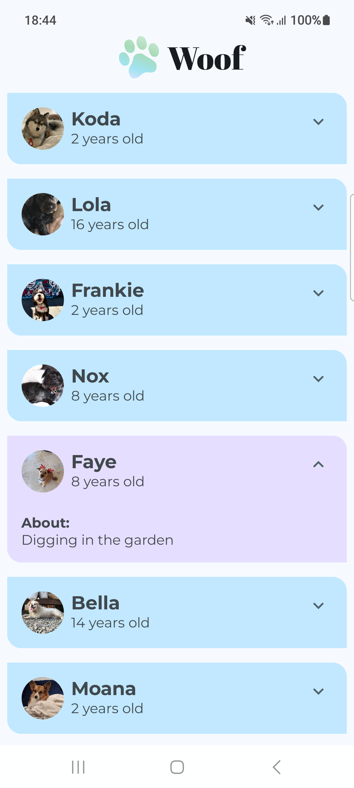

# Woof

- Used `LazyColumn`
- Learnt [Material Theming](https://developer.android.com/codelabs/basic-android-kotlin-compose-material-theming#0)
- Used Light and Dark themes (and previews for each theme)
- Used TopAppBar Composable
- Used custom font styles
- Learnt [Animations in Compose](https://developer.android.com/codelabs/basic-android-kotlin-compose-woof-animation#0)

