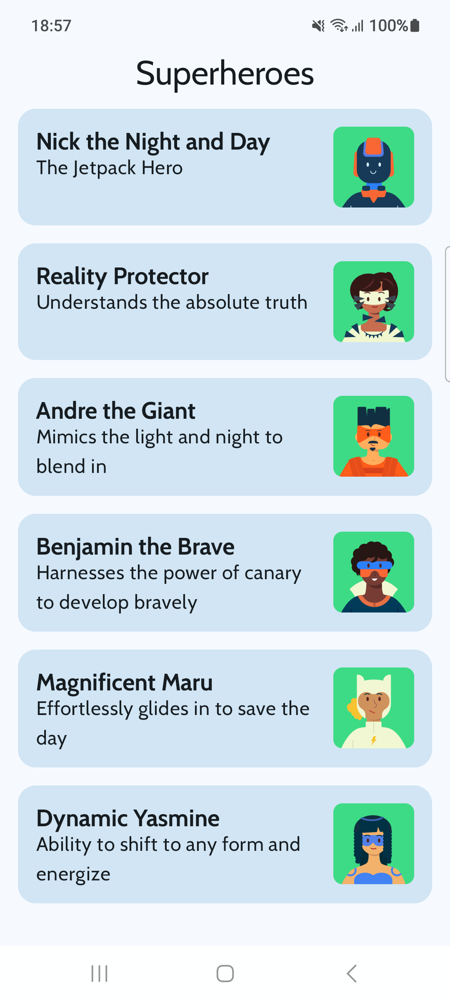

# Superheroes

- Used `LazyColumn`
- Used `ElevatedCard` Composable
- Add [Material Theming](https://developer.android.com/codelabs/basic-android-kotlin-compose-material-theming#0)
- Used Light and Dark themes (and previews for each theme)
- Used TopAppBar Composable
- Used custom font styles

> Learnt a new use-case of `weight` modifier: 
>
> It can be used for allowing on of the Composable to occupy the remaining space, when all other composables have fixed size.

