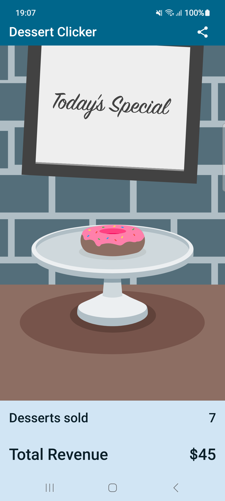

# Dessert Clicker

- Learnt to use `rememberSaveable` to retain state during configuration changes
- Used `ViewModel` as a State Holder, so that code is testable (we need to include a separate dependency)
- Learnt to Access `Context` from Composables
- Used `Intent` to share text data with other apps

