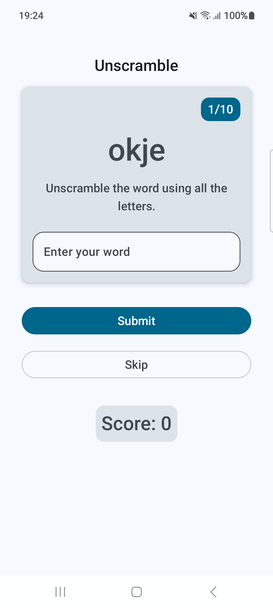
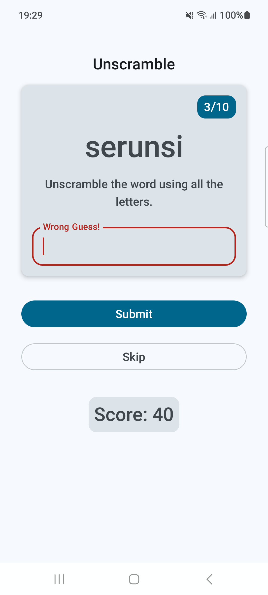

# Unscramble

- Learnt to use `ViewModel` as a State Holder, so that code is testable (we need to include a separate dependency)
- Learnt to write [local unit tests for a `ViewModel`](https://developer.android.com/codelabs/basic-android-kotlin-compose-test-viewmodel#0)
    - Write tests as per different paths (Success path, Error Path, Boundary case)
    - Learnt to _run tests with coverage_ and increase the test-coverage

