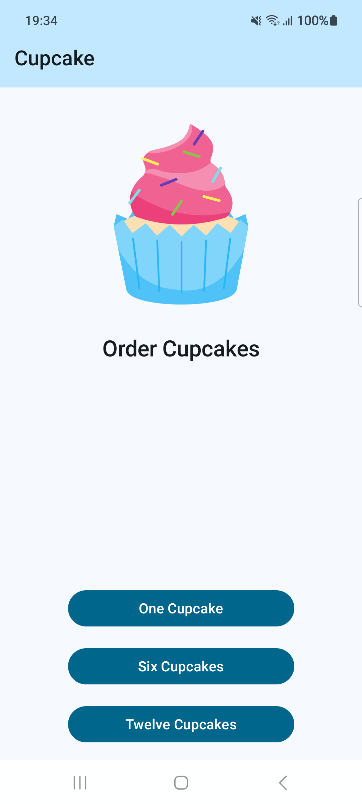
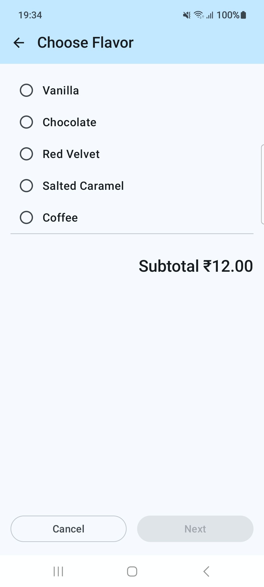
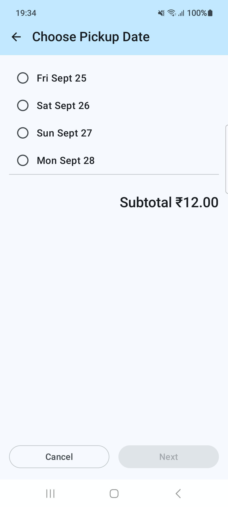
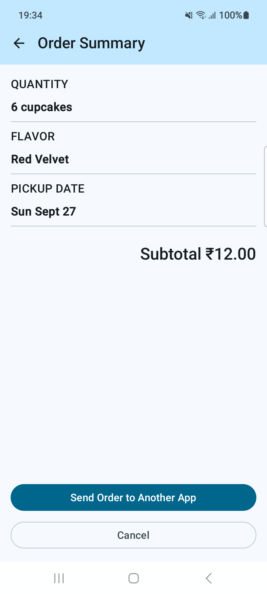

# Unscramble

- Learnt to use [Navigation with Jetpack Compose](https://developer.android.com/codelabs/basic-android-kotlin-compose-navigation)
- Implement **Next**, **Cancel** and **Back** navigation
- Reuse custom Composables and Screens for different use-cases
- Use **Up button** to navigate to previous screen
- Wrote [Instrumentation tests for Navigation and Compose Screens](https://developer.android.com/codelabs/basic-android-kotlin-compose-test-cupcake)

> Used `TopAppBar` that makes status-bar insets as part of the app

