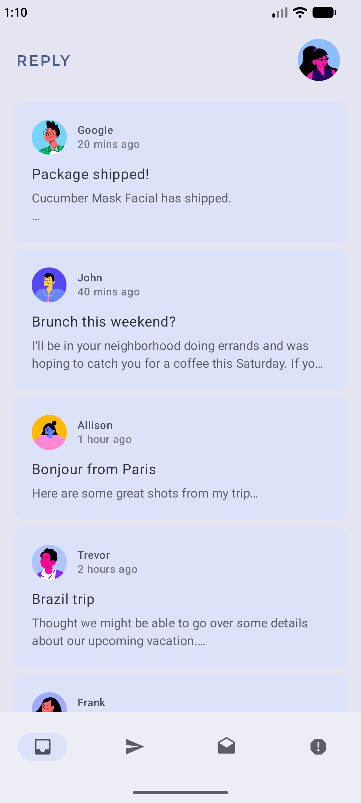
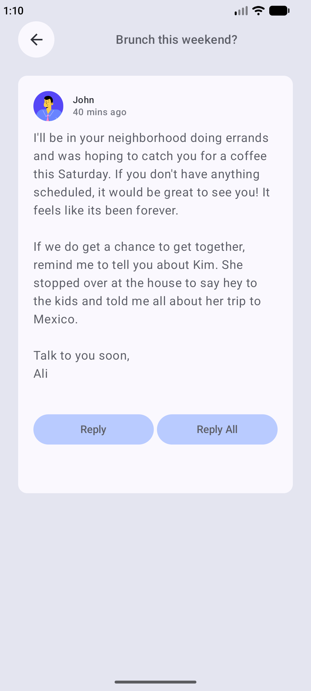
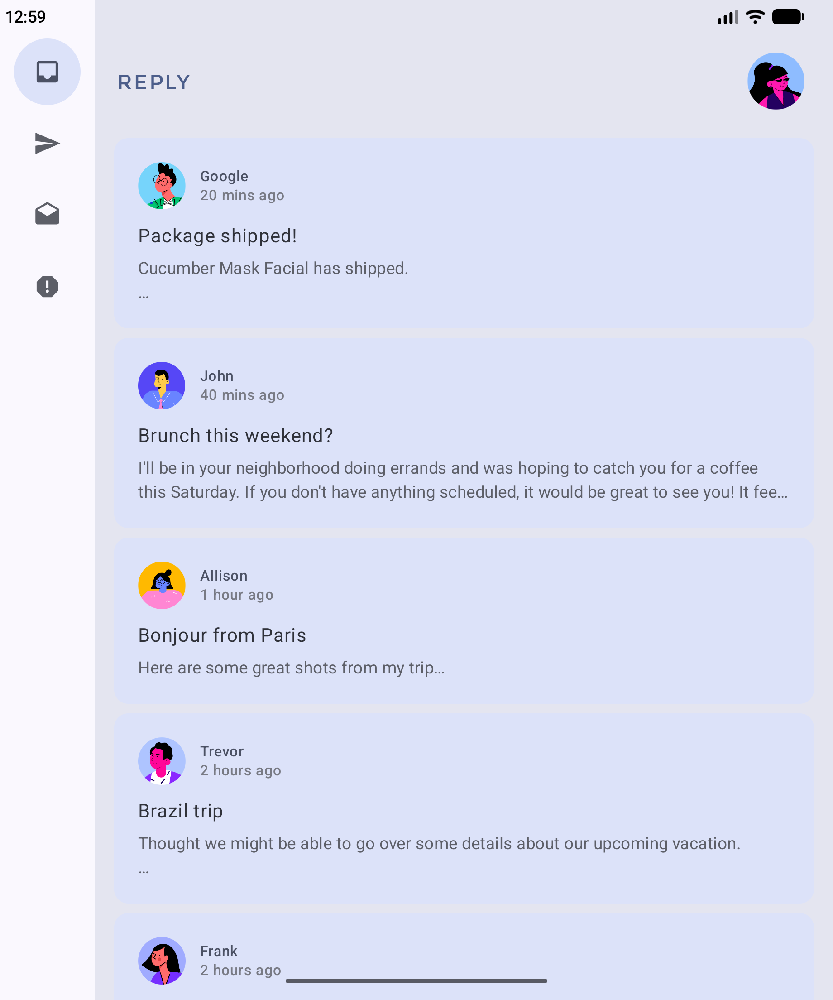
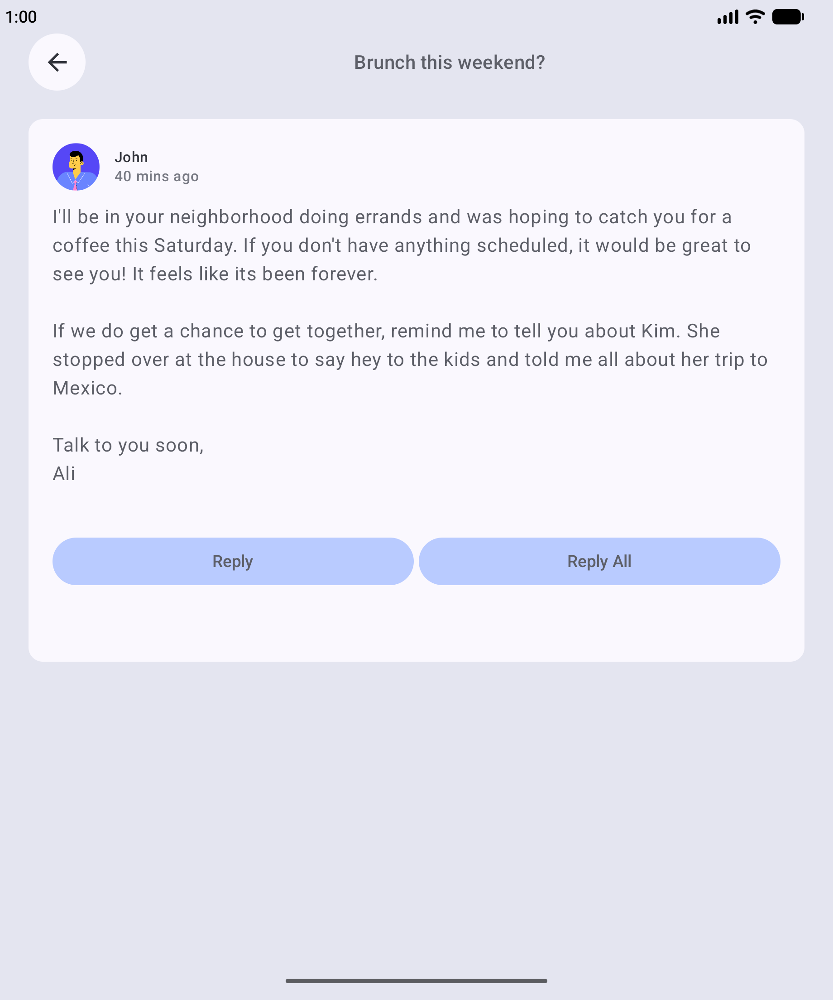
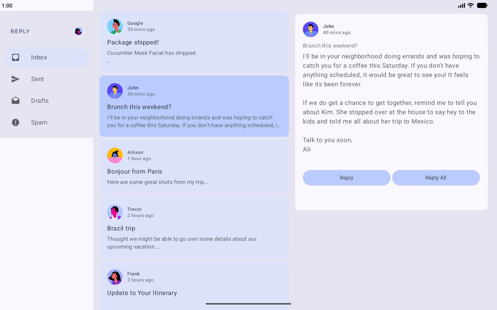

# Reply

- Used custom navigation and back press handling
- Learnt to [Build an adaptive app with dynamic navigation](https://developer.android.com/codelabs/basic-android-kotlin-compose-adaptive-navigation-for-large-screens)
- Used Resizable AVD to test for different screen sizes
- Used multi previews for different screen sizes
- Wrote [automated test for adaptive apps and configuration changes](https://developer.android.com/codelabs/basic-android-kotlin-compose-adaptive-content-for-large-screens#4)
    - Wrote test rule extension functions
    - Wrote screen-size specific tests that can run together by adding a run configuration

