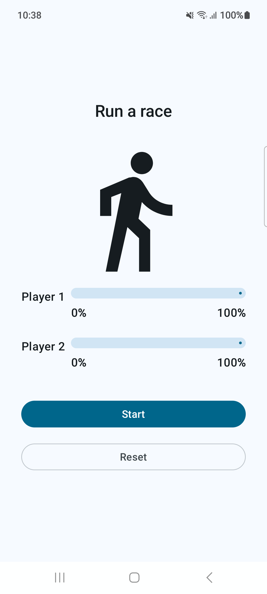
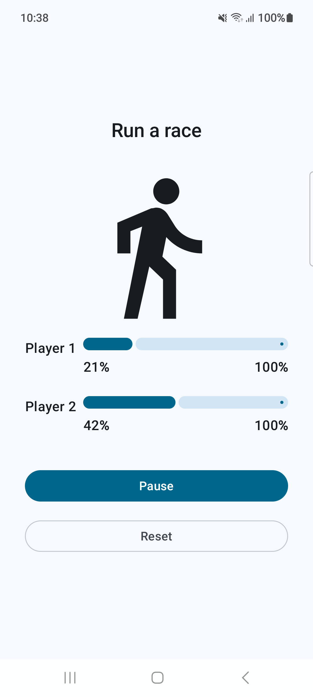

# Race Tracker

- Used [coroutines in `LaunchedEffect` composable](https://developer.android.com/codelabs/basic-android-kotlin-compose-coroutines-android-studio#0)
- Wrote [local tests for coroutines](https://developer.android.com/codelabs/basic-android-kotlin-compose-coroutines-android-studio#6)

