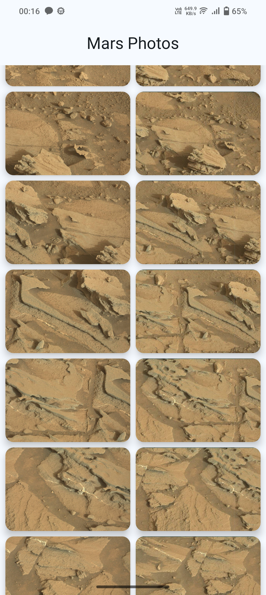

# Mars Photos

- Used retrofit for communicating with a RESTful server.
- Used `sealed class` to include handle different exceptions in user-friendly way.
- Used [**Kotlin Serialization**](https://github.com/Kotlin/kotlinx.serialization/) to convert JSON Objects to Kotlin data class and vice-versa.
    - Used **retrofit-kotlin-serialization** to directly convert JSON objects into Kotlin data class when making API calls
- Used data layer for separation of concerns (Repository class)
- Used manual dependency injection (container in the `Application` class)
    - Used `ViewModelProvider.Factory` to create `ViewModel` that accepts a parameter in it's constructor
- [Tested repository and view model](https://developer.android.com/codelabs/basic-android-kotlin-compose-add-repository#6) by creating fake data
- Used [Coil](https://coil-kt.github.io/coil/) to inflate images into `AsyncImage` composable

