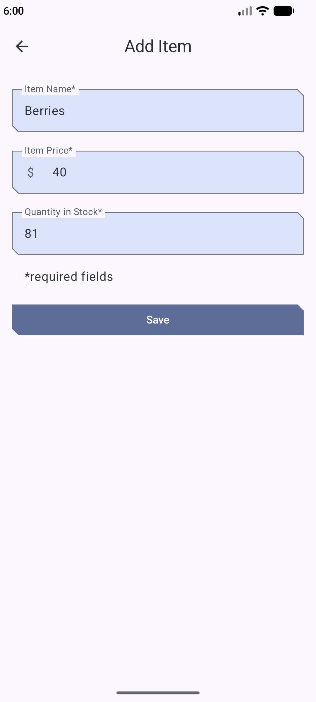
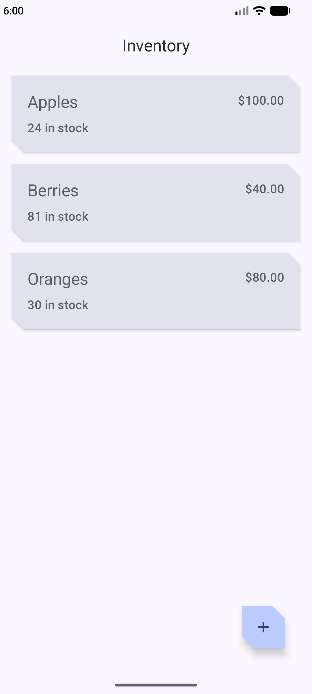
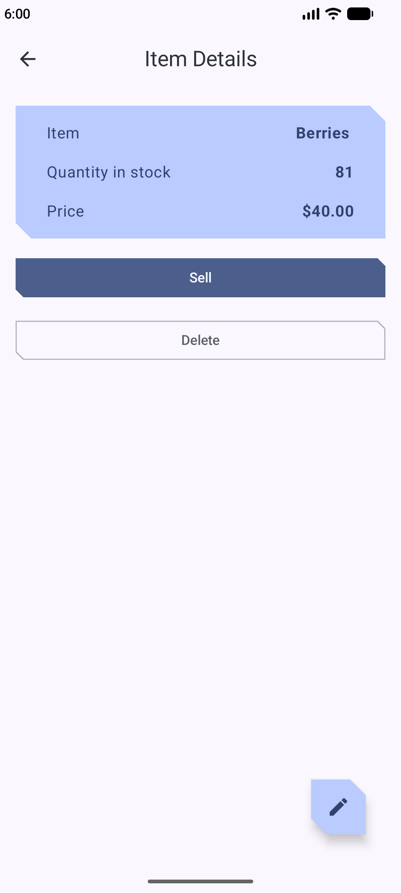
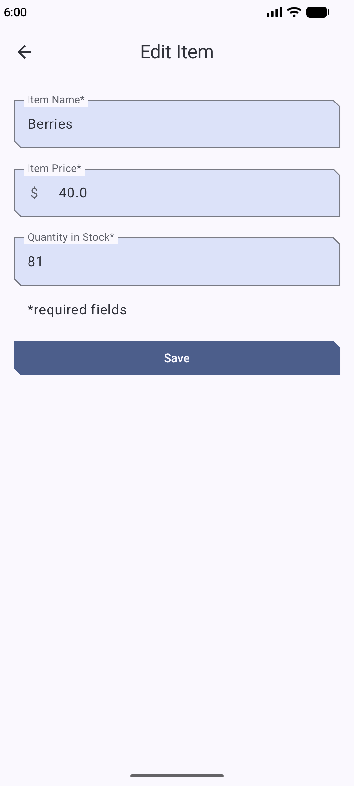

# Inventory

- Used RoomDB
- Used data layer for separation of concerns (Repository class)
- Used manual dependency injection (container in the `Application` class)
- Used navigation having **routes with arguments**
- Used `SavedStateHandle` in `ViewModel` and access navigation arguments from the `SavedStateHandle`
- Used `rememberCoroutineScope()` to launch coroutines from a Composable
- Converted a `Flow` into a `StateFlow` to hold data in the `ViewModel`
- Wrote `androidTests` for the database operations [insert](https://developer.android.com/codelabs/basic-android-kotlin-compose-update-data-room#4), [update, delete, select](https://developer.android.com/codelabs/basic-android-kotlin-compose-update-data-room#7)
- Used `AlertDialog` composable

