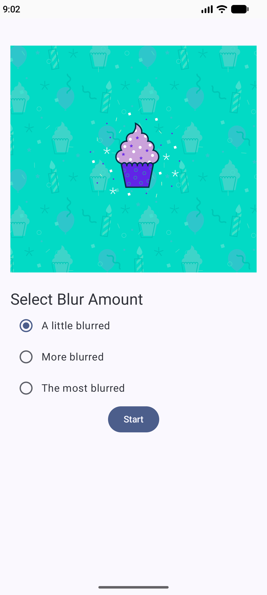
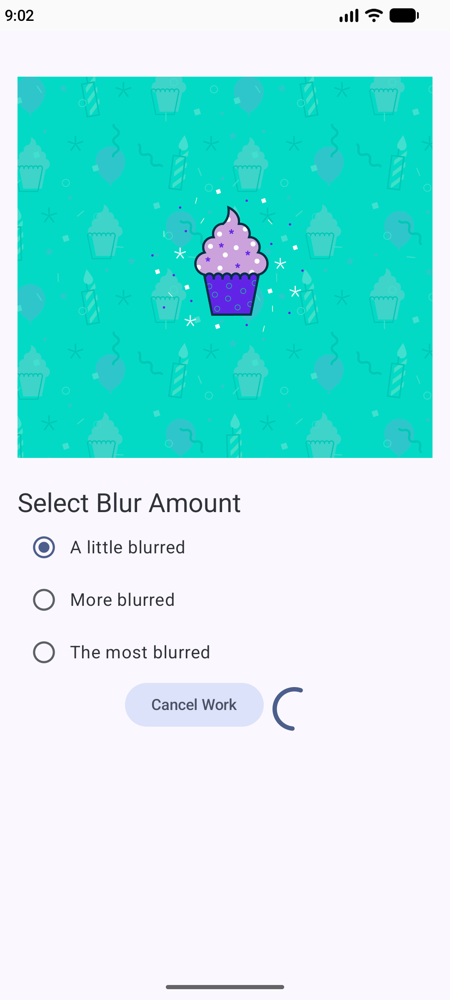
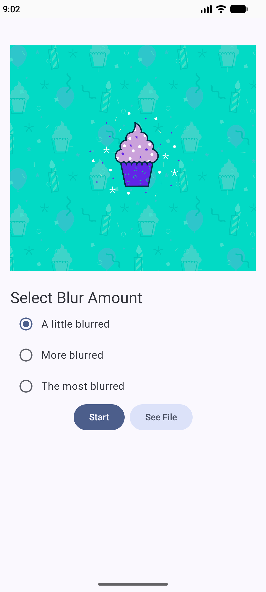

# Blur O Matic

- [Built app using `WorkManager`](https://developer.android.com/codelabs/basic-android-kotlin-compose-workmanage)
- Used `WorkManagerRepository` adhering to the **design principle of separation of concerns**
- Passed data to the worker
- **Chained** multiple Workers together for cleanup, blurring image, and saving image to a permanent file
    - passed data from previous worker to the next worker
- Ensured unique work requests
- Get `WorkInfo` of the currently running work, and upate UI
- View permanently saved image using `Intent`
- Cancel work
- Add contraints for a work (low battery)
- Wrote [instrumentation tests](https://developer.android.com/codelabs/basic-android-kotlin-compose-verify-background-work#7)
    - we need to write **instrumentation tests** because we need to access Context for the WorkManager to run
- Used **Background Task Inspector** tool to  inspect and debug workers

