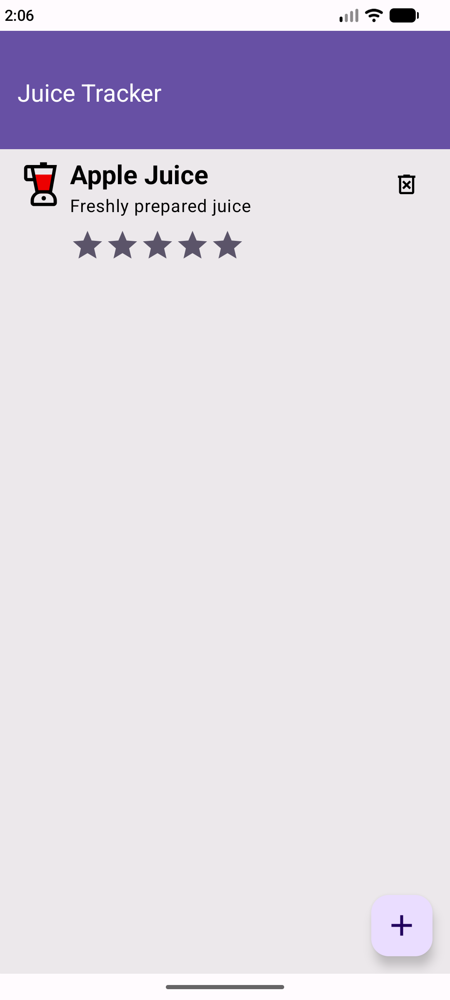
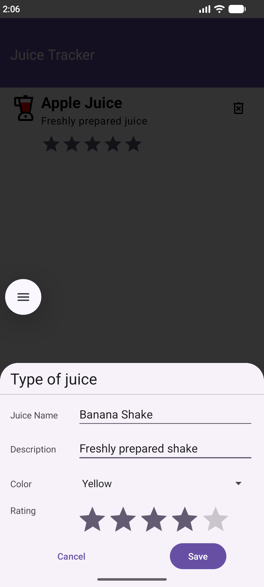
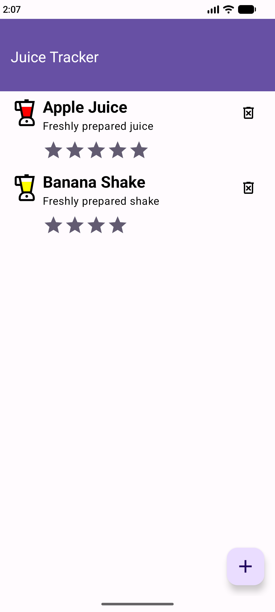

# Juice Tracker

- Android Views app, where we integrate Compose.
- used `BottomSheetDialogFragment`
- added Compose Dependencies
- replaced `list_item` XML with `ListItem` composable for `ListAdapter`
    - `composeView.setContent{}`

> A `ComposeView` is an Android View that can host Jetpack Compose UI content.
> 
> Use `setContent` to supply the content composable function for the view.

